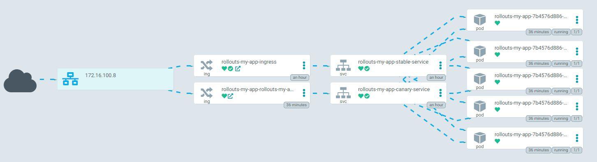
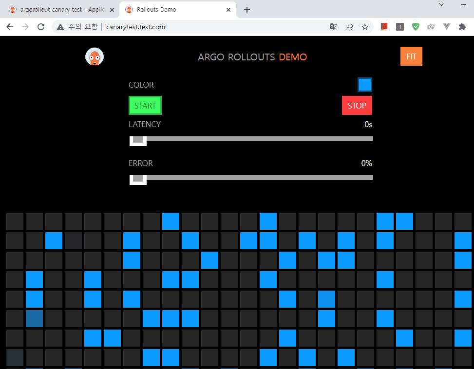
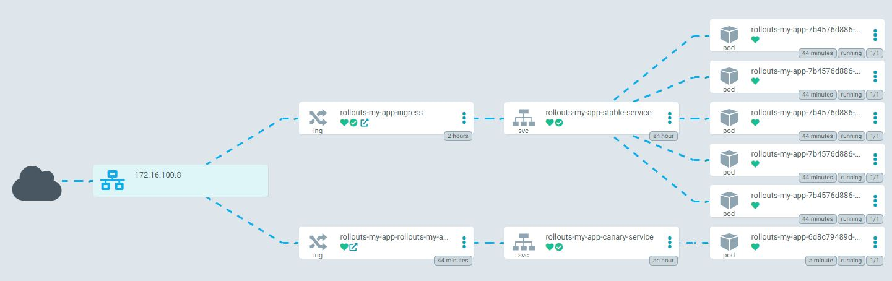
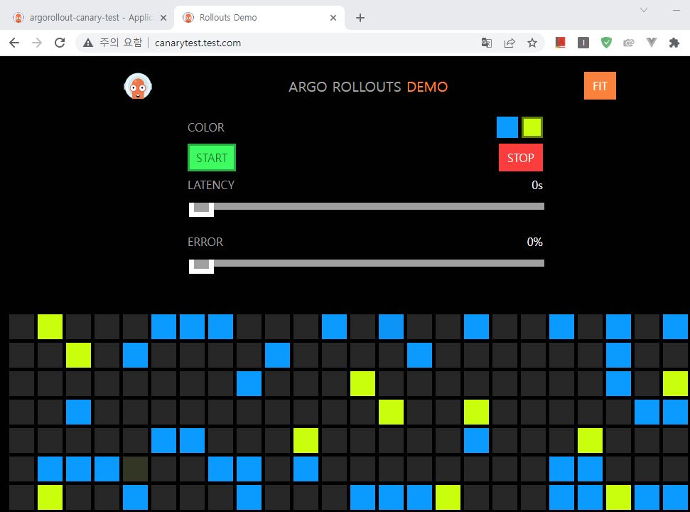
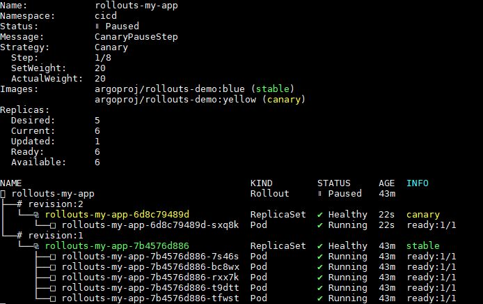
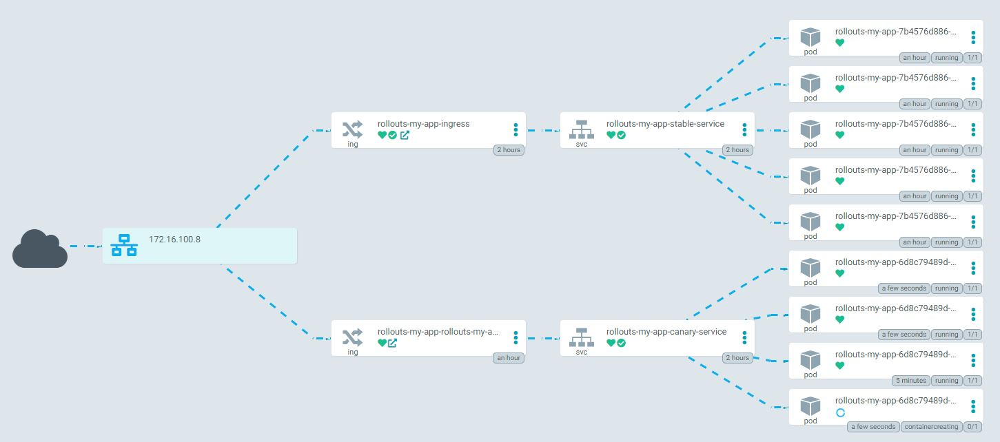
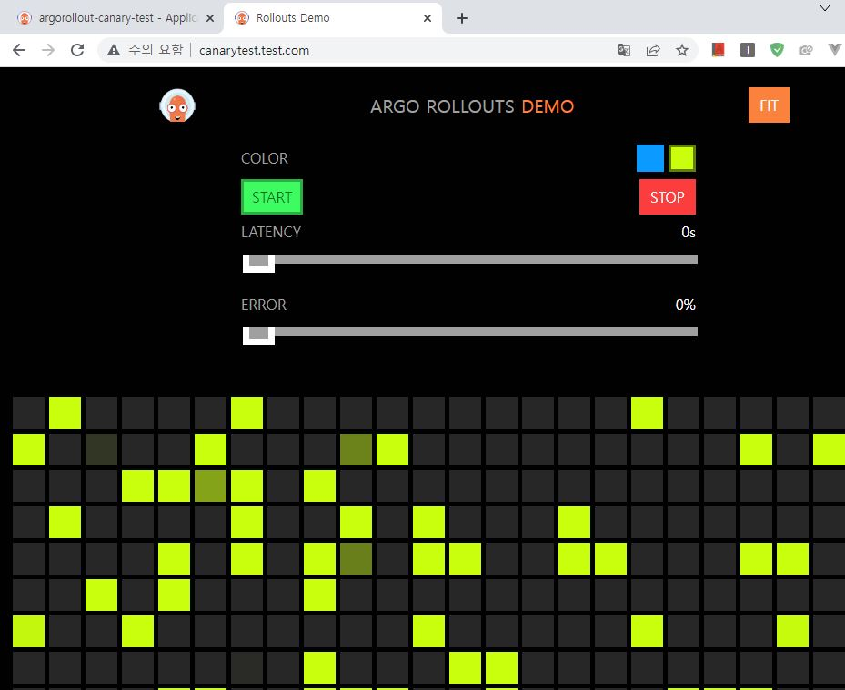
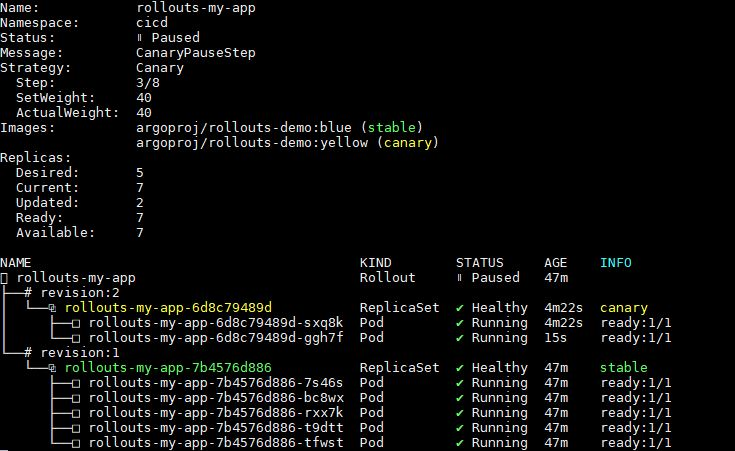
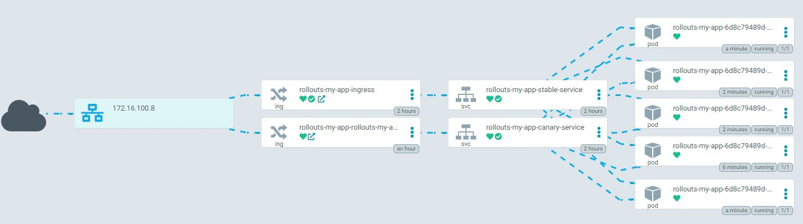

# Argo Rollout Test with Ingress (feat. ingress nginx controller)

## 수행환경

- K8S 환경
- Argo rollout 설치환경
- Ingress Nginx Controller 설치환경

## 접속구조

### 1. stable 상태

client -> L4 lb -> ingress nginx controller -> stable-ingress -> stable-service -> stable-pod

### 2. canary 배포 상태

1. client -> L4 lb -> ingress nginx controller -> stable-ingress -> stable-service -> stable-pod
2. client -> L4 lb -> ingress nginx controller -> canary-ingress -> canary-service -> canary-pod

weight 비중에 따라 분배

(cookie, header parameter 에 따라서도 분배 가능하도록 전략변경가능)

rollouts-pod-template-hash label에 의해 stable과 canary 상태가 구분됨

## 수행순서

### 1. 리소스 배포

```
kubectl create ns cicd
kubectl apply -f basic-service.yaml
kubectl apply -f basic-ingress.yaml
kubectl apply -f basic-rollout-canary.yaml
```

#### argocd 상태



#### 접속 시 화면



### 2. Rollout 수행 (canary 배포)

```
kubectl argo rollouts -n cicd set image rollouts-my-app rollouts-my-app=argoproj/rollouts-demo:yellow
```

#### argocd 상태



#### 접속 시 화면



### 3. Rollout 상태 확인

```
kubectl argo rollouts -n cicd get rollout rollouts-my-app --watch
```

#### Rollout 상태



### 4. Rollout 진행

```
kubectl argo rollouts -n cicd promote rollouts-my-app
```

#### argocd 상태



#### 접속 시 화면



#### Rollout 상태



### 5. Rollout 완료

#### argocd 상태


